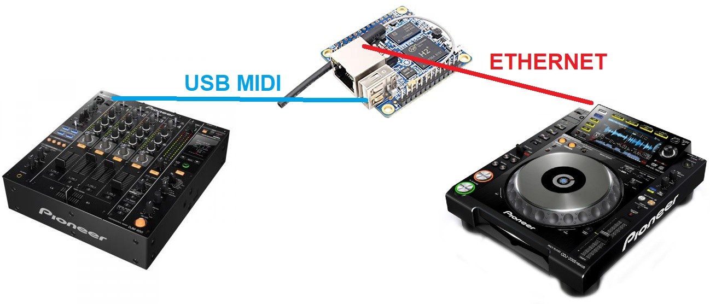
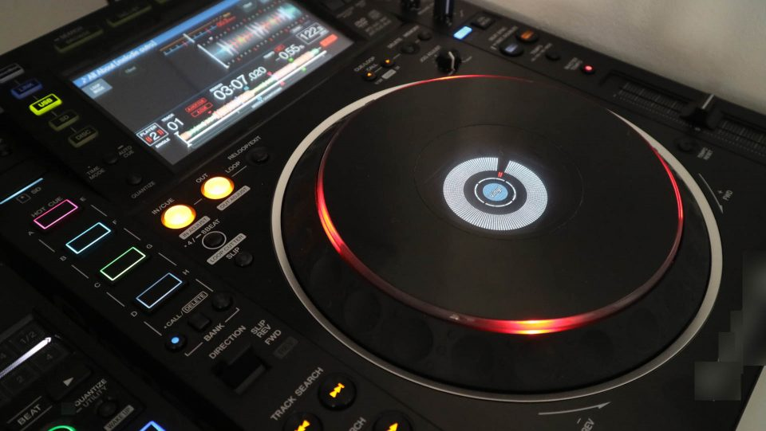
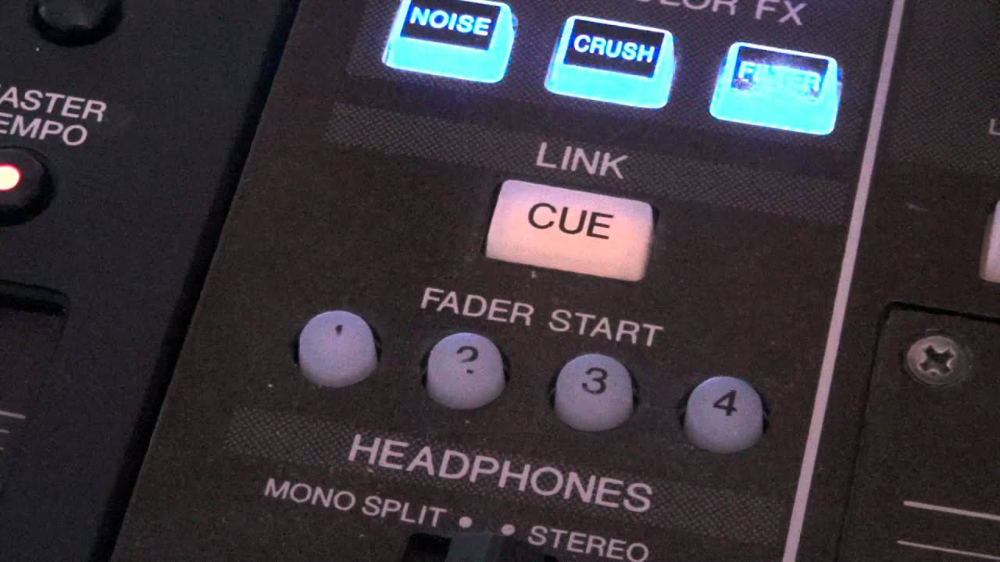

# On Air Link

Bridge betweeen mixers' USB MIDI and ethernet, allowing *On Air Display* and *Fader Start* via Pioneer Pro DJ Link.

>Tested with DJM850, CDJ2000/2000NSX and OrangePi Zero (Armbian).





## Setup and Install (Armbian)

```bash
sudo ./setup.sh
```
